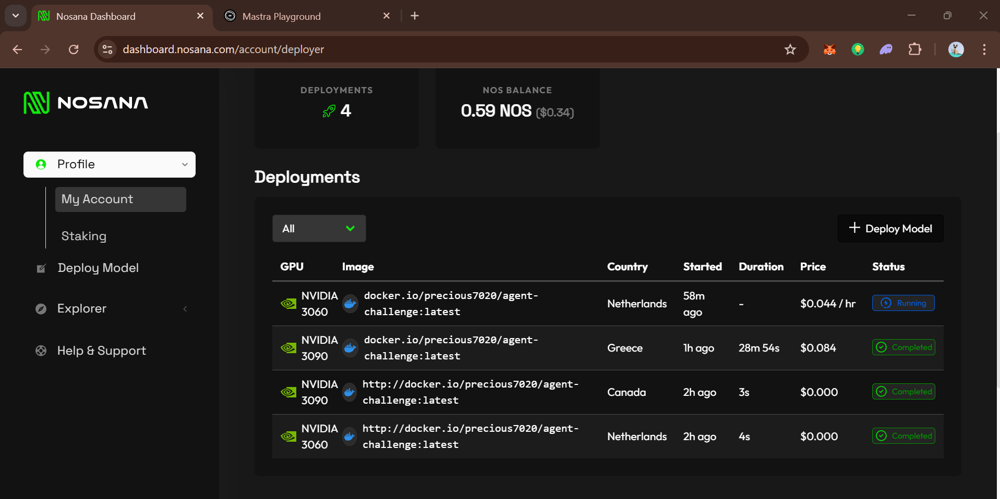

*Figure 1: GitHealth AI agent running on nosana*

GitHealth Agent - README Document
=================================

🔍 AGENT DESCRIPTION & PURPOSE
=================================

The GitHealth Agent is an AI-powered cybersecurity tool designed to enhance the security of open-source healthcare applications. Built using the Mastra framework, this agent scans GitHub repositories for known vulnerabilities (CVEs) in their dependencies by leveraging the OSV API.

⚙️ SETUP INSTRUCTIONS (LOCAL DEVELOPMENT)
=================================

1. Clone the repository:
   git clone https://github.com/Gbemi-design/agent-challenge.git
   cd agent-challenge
2. Install dependencies:
   pnpm install
3. Start the development server:
   pnpm run dev

   The Playground will be available at:
   http://localhost:8080

🔐 ENVIRONMENT VARIABLES

**Create a .env or .env.docker file with the following:**

MODEL_NAME_AT_ENDPOINT=qwen2.5:1.5b
API_BASE_URL=http://127.0.0.1:11434/api

(* Do NOT commit your .env file. Instead, create a .env.example withou
t secrets. *)

**For Nosana Endpoint (optional)**

MODEL_NAME_AT_ENDPOINT=qwen2.5:1.5b
API_BASE_URL=https://dashboard.nosana.com/jobs/GPVMUckqjKR6FwqnxDeDRqbn34BH7gAa5xWnWuNH1drf

🐳 DOCKER COMMANDS
==================

1. Build the Docker image:
   docker build -t precious7020/agent-challenge:latest .
2. Run the Docker container:
   docker run -p 8080:8080 --env-file .env.docker precious7020/agent-challenge:latest
3. Push to Docker Hub: (For this you need to resgister on Docker)
4. docker login
5. docker push precious7020/agent-challenge:latest

🚀 NOSANA DEPLOYMENT
====================

To deploy on Nosana:

1. Update the nosana_mastra.json job file:

   - Add your Docker image under "image"
   - Include environment variables
2. Deploy via CLI:
   nosana job post --file ./nos_job_def/nosana_mastra.json --market nvidia-3090 --timeout 30
3. View your job at:
   https://dashboard.nosana.com

📌 NOTES
========

- This agent uses Ollama LLM (qwen2.5:1.5b).
- Mastra Playground should be accessible at http://localhost:8080 during local dev.
- On production builds or headless runs, only the API is exposed (no UI).

📌 LINKS
========

Video Link: https://youtu.be/_SG6VTskCLY

Docker Hub Link: https://hub.docker.com/r/precious7020/agent-challenge

Twitter (X) Link: https://x.com/shortbread007/status/1944168300298350770
